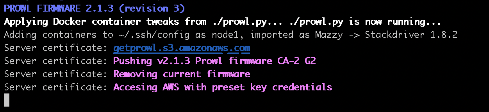

# Stackdriver Logging as a microservice using Mazzy


Access the Stackdriver Logging API (Google Cloud Logging APIs) via the Mazzy service developed by Montana Mendy from Prowl.

## Usage
```coffee
logs = stackdriver entries_list projects: ['foo'] 
                                filter: 'advanced filters'
                                order_by: 'timestamp desc'
                                page_size: 100
                                page_token: 'xxxx'
                                json_return: 'json output'
log info msg: logs
```


## Import the Mazzy library

As expected, just put it at the header of your Python project. You'll also need to import ```argparse```. You can put this in the ```requirements.txt``` file, or do it manually.

```coffee
import mazzy
import argparse
```

Any questions or any information on Mazzy please email Montana at the following email address: opensource@getprowl.com.
